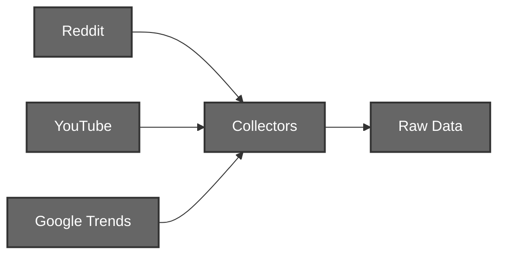
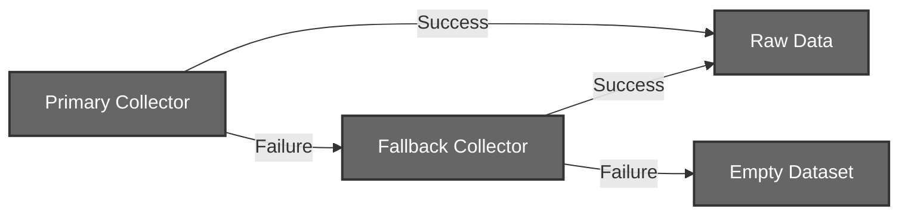
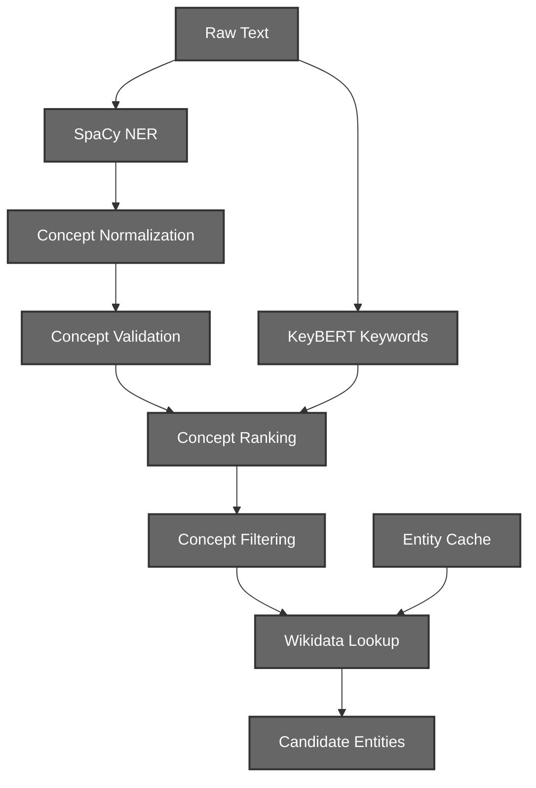
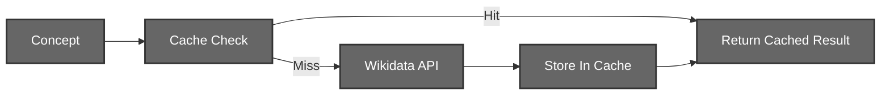
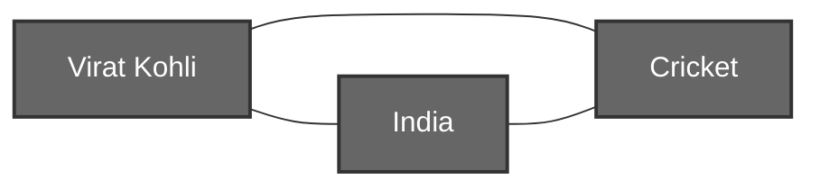
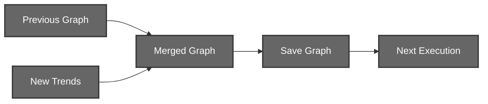
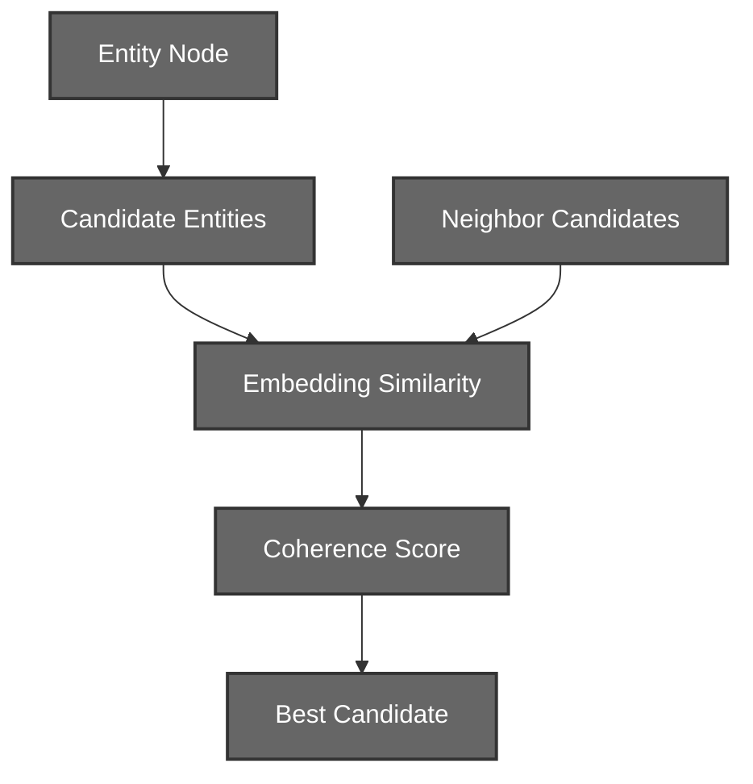
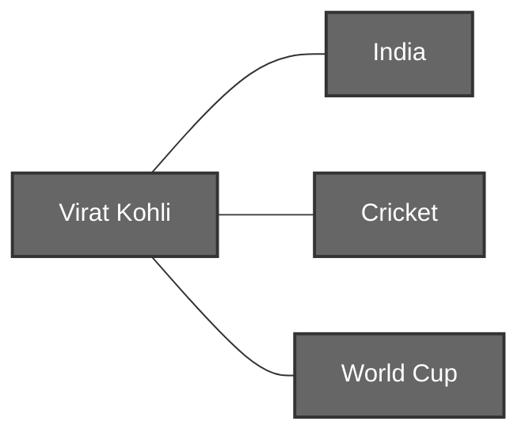
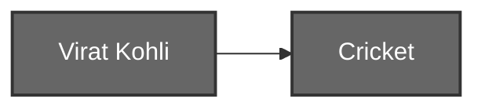

# Trend Engine (Layer 1)

## Graph-Based Trend Intelligence System

# 1. Introduction

Trend Engine is a graph-based trend intelligence system designed to collect trending content from multiple online platforms, extract meaningful entities and concepts, resolve ambiguities using graph context, generate semantic tags, and maintain a persistent evolving knowledge graph.

Unlike traditional trend aggregators that process every trend independently, Trend Engine accumulates knowledge over time. Every new trend enriches the graph, making future entity resolution and tagging more accurate.

The system currently collects data from:

* Reddit
* YouTube Trending
* Google Trends

and transforms raw trend data into a structured graph representation.

---

# 2. Pipeline Motivation

Traditional trend pipelines typically work as:

```text
Fetch Trend
    ↓
Extract Entities
    ↓
Store Result
```

This approach has several limitations:

## No Historical Context

Example:

```text
Day 1:
ICC

Day 10:
World Cup
Rohit Sharma
Cricket
```

A traditional pipeline treats these independently.

There is no mechanism for Day 10 information to improve Day 1 understanding.

## Poor Entity Resolution

Example:

```text
Apple
```

Possible meanings:

* Apple Inc.
* Apple Fruit
* Apple Records

Without surrounding context, selecting the correct meaning becomes difficult.


## Weak Categorization

A single entity description often lacks enough information to determine accurate tags.

Example:

```text
Virat Kohli
```

Description alone provides limited context.

However:

```text
Virat Kohli
Cricket
India
World Cup
IPL
```

provides much richer semantic information.

---

# 3. System Architecture


The graph becomes the central source of truth.

Every component either enriches or maintains the graph.

---

# 4. Technology Stack

| Component            | Technology            | Purpose                     |
| -------------------- | --------------------- | --------------------------- |
| Trend Collection     | Reddit API            | Reddit trends               |
| Trend Collection     | YouTube Data API      | Trending videos             |
| Trend Collection     | Google Trends API     | Search trends               |
| Entity Extraction    | SpaCy                 | Named Entity Recognition    |
| Keyword Extraction   | KeyBERT               | Semantic keyword extraction |
| Entity Resolution    | Sentence Transformers | Semantic similarity         |
| Knowledge Base       | Wikidata              | Candidate retrieval         |
| Graph Representation | NetworkX              | Graph construction          |
| Persistence          | Pickle                | Graph storage               |
| Similarity Search    | Cosine Similarity     | Candidate ranking           |

---

# 5. Data Collection Layer

The system collects trends from multiple independent sources.



## Fallback Collection

To improve reliability, the system includes lightweight fallback collectors for Reddit and Google Trends.

When an API-based collector fails:

* Reddit falls back to scraping the public `r/popular` feed.
* Google Trends falls back to the public RSS trending feed.
* If both the primary collector and fallback fail, an empty dataset is returned.



Since the graph is persistent, previously collected trends are never reloaded as fallback data. If collection fails completely, the engine simply skips updates for that source and allows existing nodes to age naturally through the pruning system.

Each collector is responsible only for:

* Fetching data
* Normalizing structure
* Saving raw results

No processing occurs here.

---

# 6. Trend Processing Pipeline

The Trend Processor transforms raw social media content into structured graph-ready entities.

This stage is responsible for:

* Entity Extraction
* Keyword Extraction
* Concept Ranking
* Concept Filtering
* Candidate Generation
* Wikidata Resolution

The output of this stage is not a final entity.

Instead, every extracted concept is converted into a set of possible Wikidata candidates which will later be disambiguated using graph context.


## Processing Workflow



### Step 1: Text Construction

Each source uses a dedicated text builder.

#### Reddit

```text
Title + Post Description
```

#### YouTube

```text
Video Title + Description
```

#### Google Trends

```text
Trend + Trend Breakdown
```

This creates a unified text representation regardless of source.

### Step 2: Concept Extraction (SpaCy)

The first stage uses SpaCy's Named Entity Recognition model.

Supported entity categories include:

```text
PERSON
ORG
GPE
PRODUCT
EVENT
WORK_OF_ART
NORP
FAC
LOC
```

Certain entity categories are intentionally ignored.

Examples:

```text
DATE
TIME
MONEY
PERCENT
ORDINAL
CARDINAL
```

These rarely contribute useful trend information.


#### Example

Input:

```text
India defeats Australia in World Cup Final
```

SpaCy may produce:

```text
India
Australia
World Cup
```

These are converted into candidate concepts.

### Step 3: Concept Normalization

Extracted concepts are normalized before further processing.

Operations include:

```text
1. Lowercasing
2. Whitespace Cleanup
3. Possessive Removal
4. Quote Normalization
5. Punctuation Cleanup
```

This greatly improves deduplication.

### Step 4: Concept Validation

Not every extracted phrase should become a graph node.

The validation stage removes:
```text
1. Very Short Concepts
2. Pure Numbers
3. URLs
4. Emojis
5. Reddit Paths
6. Invalid Tokens (Concepts containing excessive symbols or malformed text)
```

This prevents graph pollution before nodes are created.

### Step 5: Keyword Extraction (KeyBERT)

While SpaCy identifies named entities, many important concepts never appear as entities.

Example:

```text
India wins Cricket World Cup Final
```

SpaCy:

```text
India
```

Potentially misses:

```text
Cricket World Cup
```

To solve this, KeyBERT is used.

#### Why KeyBERT?

Traditional keyword extraction often relies on:

```text
TF-IDF
Frequency Counts
```

These methods perform poorly on short trend descriptions.

KeyBERT instead uses semantic embeddings.

Benefits:

* Better phrase extraction
* Context awareness
* Better multi-word concepts

#### Configuration

The system uses:

```python
use_mmr=True
diversity=0.9
```

This encourages diversity and reduces duplicate keywords.

#### Additional Filtering

Keywords undergo:

* Validation
* Deduplication
* Score Thresholding
* Coverage Filtering

Example:

```text
cricket world cup
world cup
cup
```

Only the strongest representative keyword is retained.

### Step 6: Concept Ranking

Extracted concepts are assigned scores.

The score combines:

```text
Entity Type Weight
+
Keyword Overlap Score
```

#### Entity Type Weight

Certain entity types are naturally more informative.

Example:

```text
PERSON
ORG
PRODUCT
EVENT
```

receive higher weights than generic concepts.

#### Keyword Reinforcement

Concepts that overlap with high-scoring keywords receive additional score boosts.

Example:

Concept:

```text
world cup
```

Keyword:

```text
cricket world cup
```

The overlap increases confidence.

### Step 7: Concept Selection

After scoring, concepts are ranked.

Only the highest quality concepts are retained.

```text
Additionally : Multi-word keywords are injected into the final concept set even if SpaCy did not identify them.
```

This helps preserve important phrases.

### Step 8: Wikidata Candidate Retrieval

The processor does not directly resolve entities.

Instead, it retrieves candidate entities from Wikidata.

Example:

```text
Apple
```

Candidates:

```text
Apple Inc.
Apple Fruit
Apple Records
```

The processor stores all possibilities.

The graph resolver will later determine the correct meaning.

### Step 9: Local Wikidata Cache

Repeated Wikidata requests are expensive.

To reduce network calls, every lookup is cached.



Benefits:

* Faster execution
* Reduced API usage
* Better rate-limit handling


### Step 10: Candidate Set Creation

The final output of the processor is:

```python
{
    "apple": [
        {
            "id": "Q312",
            "label": "Apple Inc.",
            "description": "technology company"
        },
        {
            "id": "Q89",
            "label": "Apple",
            "description": "fruit"
        }
    ]
}
```

No final resolution occurs at this stage.

The processor's responsibility ends after generating candidate sets.

Entity disambiguation is performed later by the graph-based resolver using neighborhood context.

---

# 7. Graph Construction

The graph is the core data structure of the system.


## Entity Nodes

Every concept becomes a node.

Example:

```text
Virat Kohli
India
Cricket
```


## Relationship Edges

Entities appearing together are connected.



## Entity Node Schema

Every extracted concept is represented as an entity node.

```python
{
    "node_type": "entity",

    "candidates": [
        {
            "id": str,
            "label": str,
            "description": str
        }
    ],

    "resolved": {
        "id": str,
        "label": str,
        "description": str
    } | None,

    "confidence": float,

    "mentions": int,

    "created_at": str,

    "last_seen": str,

    "source_counts": {
        "reddit": int,
        "youtube": int,
        "google_trends": int
    },

    "trend_ids": set[str]
}
```

### Field Description

| Field         | Description                                          |
| ------------- | ---------------------------------------------------- |
| node_type     | Identifies the node as an entity                     |
| candidates    | Wikidata candidates associated with the concept      |
| resolved      | Final selected Wikidata entity                       |
| confidence    | Resolution confidence score                          |
| mentions      | Total number of occurrences                          |
| created_at    | Timestamp when the entity first appeared             |
| last_seen     | Timestamp when the entity was most recently observed |
| source_counts | Per-source occurrence statistics                     |
| trend_ids     | Set of trend identifiers contributing to the node    |


## Entity Edge Schema

Relationships between co-occurring entities.

```python
{
    "weight": int,

    "created_at": str,

    "last_seen": str,

    "source_counts": {
        "reddit": int,
        "youtube": int,
        "google_trends": int
    }
}
```

### Field Description

| Field         | Description                         |
| ------------- | ----------------------------------- |
| weight        | Number of co-occurrences            |
| created_at    | Timestamp of first occurrence       |
| last_seen     | Timestamp of most recent occurrence |
| source_counts | Per-source co-occurrence statistics |


## Tag Node Schema

Semantic category nodes used for hierarchical classification.

```python
{
    "node_type": "tag",

    "tag": str,

    "level": int,

    "parent": str | None,

    "children_count": int,

    "entity_count": int
}
```

### Field Description

| Field          | Description                                                    |
| -------------- | -------------------------------------------------------------- |
| node_type      | Identifies the node as a tag                                   |
| tag            | Tag label                                                      |
| level          | Depth within the tag hierarchy                                 |
| parent         | Parent tag node                                                |
| children_count | Number of direct child tags                                    |
| entity_count   | Number of entities associated with this tag or its descendants |


## Parent Tag Edge Schema

Represents hierarchical relationships between tags.

```python
{
    "relation": "parent_tag"
}
```

## Entity Tag Edge Schema

Represents semantic assignments between entities and tags.

```python
{
    "relation": "has_tag",

    "confidence": float
}
```

### Field Description

| Field      | Description                             |
| ---------- | --------------------------------------- |
| relation   | Type of relationship                    |
| confidence | Similarity score assigned by the tagger |


---

# 8. Persistent Graph Design

One of the most important architectural decisions was introducing graph persistence.


## Problem

Without persistence:

```text
Run 1
    ↓
Graph Lost

Run 2
    ↓
Graph Rebuilt
```

All accumulated context disappears.


## Solution



The graph becomes long-term memory.

---

# 9. Entity Resolution

## Problem

Many concepts are ambiguous.

Example:

```text
Apple
```

Possible meanings:

```text
Apple Inc.
Apple Fruit
Apple Records
```

## Final Approach

Graph-Based Entity Resolution

Candidate selection is based on:

```text
Prior Probability
+
Neighborhood Coherence
```


## Resolution Workflow




## Important Design Decision

Resolution only occurs when:

```text
Neighbor Count >= 2
```

Reason:

Sparse neighborhoods rarely contain enough evidence for confident resolution.

Instead of forcing a guess, the graph waits until additional context accumulates.

---

# 10. Graph-Based Tagging

## Problem

Tagging based on a single entity description often produces weak results.

Example:

```text
Virat Kohli
```

contains limited information.


## Solution

Neighborhood-Aware Tagging

Instead of tagging:

```text
Virat Kohli
```

we tag:

```text
Virat Kohli
+
India
+
Cricket
+
World Cup
```


## Context Generation



Context is built using:

* Node's label
* Node's description
* Neighbor descriptions
* Neighbor labels


## Tag Matching

Sentence embeddings are compared against a hierarchical tag dataset.

---

# 11. Tag Hierarchy System

Tags are stored as nodes.

Example:


Entity connections:




## Why Hierarchical Tags?

Benefits:

* Multi-level categorization
* Better search
* Better trend grouping

---

# 12. Why Neighbor-Based Algorithms?

One of the most important decisions in the project.


## Rejected Approach

Connected Components

Problem:

Generic concepts can connect unrelated communities.

Example:

```text
music
video
news
```

These become graph hubs.

Connected-component approaches become noisy.


## Final Approach

Immediate Neighborhood Analysis

Algorithms only inspect:

```text
1-Hop Neighbors
```

Benefits:

* Resistant to noise
* Scales better
* Produces cleaner tags
* Produces better entity resolution

---

# 13. Graph Pruning

Without pruning the graph grows forever.


## Entity Pruning

Entities are removed when:

```text
Current Time - Last Seen > MAX_AGE_DAYS
```

## Tag Pruning

When entities disappear:


Unused tag hierarchies automatically collapse.

---

# 14. Major Challenges Faced

## Challenge 1: Ambiguous Wikidata Results

Problem:

```text
Apple
Java
ICC
```

multiple meanings.

Solution:

Graph-based coherence scoring.


## Challenge 2: Weak Tagging

Problem:

Single descriptions lacked context.

Solution:

Neighborhood-aware context generation.


## Challenge 3: Infinite Graph Growth

Problem:

Persistent graphs continuously expand.

Solution:

Timestamp-based pruning.


## Challenge 4: Repeated API Calls

Problem:

Wikidata requests were expensive.

Solution:

Local entity caching.

---

# 15. Current Capabilities

[✓] Multi-source trend collection

[✓] Named entity extraction

[✓] Keyword extraction

[✓] Wikidata candidate retrieval

[✓] Graph construction

[✓] Persistent graph storage

[✓] Graph-based entity resolution

[✓] Neighborhood-aware semantic tagging

[✓] Hierarchical tags

[✓] Automatic graph pruning

---

# 16. Conclusion

Trend Engine evolved from a simple trend collection pipeline into a persistent graph intelligence system.

Its primary strength lies in contextual accumulation.

Every trend enriches the graph, making future resolution, tagging, and trend discovery progressively more accurate.

Rather than treating trends as isolated events, Trend Engine models them as a continuously evolving network of entities, relationships, and semantic categories.
