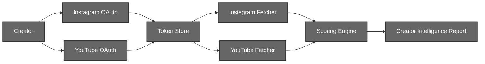
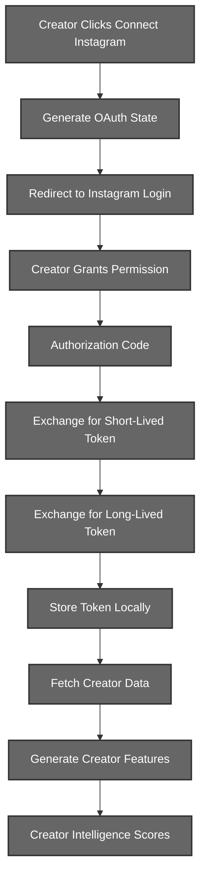
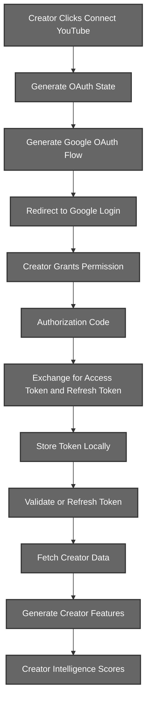

# User Engine (Layer 2)

## Creator Intelligence System

# 1. Introduction

The User Engine is responsible for collecting creator-specific information from supported social media platforms and transforming raw platform statistics into standardized creator intelligence features.

The current system supports:
- Instagram
- YouTube

Each platform follows an independent authentication and data collection pipeline while producing a unified representation that is later consumed by the Creator Intelligence Scoring Engine.

---

# 2. System Architecture



The User Engine is divided into three major stages:

- Authentication
- Data Collection
- Creator Intelligence Scoring

Each stage is platform-independent and communicates through standardized data structures.

---

# 3. Instagram Creator Intelligence Pipeline

## 3.1 Motivation

Instagram restricts access to creator information through OAuth authentication and the Instagram Graph API.

The pipeline is designed to solve several problems:

- Secure authentication without storing user passwords
- Long-term authenticated access through long-lived access tokens
- Automatic token refresh
- Normalization of multiple API responses into a single creator representation
- Graceful degradation when optional analytics are unavailable


## 3.2 Complete Workflow




## 3.3 Authentication Phase

### Step 1 : OAuth State Generation

When the creator initiates authentication, the backend generates a cryptographically secure random OAuth state.

OAuth states are temporarily stored in the local database to correlate the callback with the correct creator

### Step 2 : Instagram Authorization

Using the generated state, an Instagram OAuth URL is constructed containing:

```text
Client ID
Redirect URI
Requested Scopes
Response Type
OAuth State
```

The creator is redirected to Instagram's authorization page where they authenticate using their own Instagram credentials and explicitly grant permission to the application.

The application never receives or stores the creator's password.

### Step 3 : Authorization Code Generation

After successful authentication, Instagram redirects the creator back to the registered callback endpoint.

The callback contains:

```text
Authorization Code
OAuth State
```

The backend validates the OAuth state before continuing.

If the state is invalid or expired, the authentication request is immediately rejected.


## 3.4 Token Exchange

Instagram does not directly provide a long-lived access token.

Instead, authentication occurs in two stages.


### Stage 1 : Short-Lived Access Token

The authorization code is exchanged for a short-lived access token.

The response contains:

```text
Access Token
Instagram User ID
```

This token is temporary and is intended only as an intermediate credential.

### Stage 2 : Long-Lived Access Token

Immediately after obtaining the short-lived token, the backend exchanges it through the Instagram Graph API.

```text
Authorization Code
        ↓
Short-Lived Access Token
        ↓
Long-Lived Access Token
```

The resulting token typically remains valid for approximately sixty days.

The system stores:

```text
Access Token
Instagram User ID
Expiration Timestamp
```
instead of storing only the remaining lifetime.
Using an absolute expiration timestamp simplifies future validation and refresh operations.

## 3.5 Token Persistence

The generated long-lived token is stored locally in the Creator Token Store.

Each record is uniquely identified by:

```text
User ID
Platform
```

If the creator reconnects their Instagram account, the existing token is automatically updated rather than creating duplicate records.

This guarantees that only one active credential exists for each platform per creator.


## 3.6 Automatic Token Refresh

Before every creator analysis request, the stored token is validated.

The remaining lifetime is calculated as:

```text
Expiration Time - Current Time
```

If the token is approaching expiration, the backend automatically refreshes it through the Instagram Graph API.
This refresh process is completely transparent to the creator and eliminates the need for repeated logins.

## 3.7 Creator Data Collection

Once a valid token is available, the Instagram Fetcher retrieves creator information from multiple Graph API endpoints.


### Profile Information

The first endpoint retrieves creator account metadata.

Collected fields include:

```text
Username
Account Type
Followers Count
Following Count
Media Count
```

The pipeline only supports Business and Creator accounts.

Personal accounts are rejected because they do not expose the required analytics.

### Recent Content Collection

The second endpoint retrieves the creator's most recent posts.

For each post the following information is collected:

```text
Post ID
Caption
Media Type
Timestamp
Like Count
Comment Count
Permalink
```

Only the most recent twenty posts are retrieved.

This provides sufficient information for engagement and activity analysis while minimizing unnecessary API requests.

### Account Reach Analytics

The third endpoint attempts to retrieve creator reach statistics over the previous twenty-eight days.

Collected metric:

```text
Monthly Reach
```

Since this endpoint requires additional Instagram permissions, the fetcher follows a best-effort strategy.

If:
- permissions are unavailable,
- the endpoint changes,
- the metric is temporarily unavailable,

the fetcher simply returns:

```text
Monthly Reach = 0
```

instead of interrupting the complete creator analysis pipeline.
This design ensures that optional analytics never prevent score generation.

## 3.8 Data Normalization

The multiple Graph API responses are transformed into a single standardized creator representation.

```python
{
    "platform": "instagram",
    "username": "...",
    "followers": ...,
    "following": ...,
    "media_count": ...,
    "monthly_reach": ...,
    "recent_posts": [...]
}
```

The Scoring Engine never interacts directly with Instagram APIs.
Instead, it always receives this normalized representation regardless of how many API requests were required to construct it.

---

# 4. YouTube Creator Intelligence Pipeline

## 4.1 Motivation

Unlike Instagram, YouTube follows the standard OAuth 2.0 Authorization Code Flow and provides both an access token and a refresh token. The User Engine leverages this mechanism to maintain persistent authenticated access to creator data without requiring repeated user logins.

The YouTube pipeline is designed to solve the following problems:

- Secure creator authentication through Google OAuth
- Long-term authenticated access using refresh tokens
- Automatic access token renewal
- Efficient retrieval of creator and content statistics
- Normalization of multiple API responses into a unified creator representation

## 4.2 Complete Workflow



## 4.3 Authentication Phase

### Step 1 : OAuth State Generation

Similar to the Instagram pipeline, every authentication request begins with the creation of a cryptographically secure OAuth state.


### Step 2 : OAuth Flow Creation

The backend initializes a new Google OAuth Flow using:

```text
Client ID
Client Secret
Redirect URI
Requested Scopes
```

The following permissions are requested:

```text
youtube.readonly
yt-analytics.readonly
```

These permissions provide read-only access to creator statistics and analytics without granting any modification privileges.


### Step 3 : Google Authorization

The creator is redirected to Google's consent page.

Google authenticates the creator and displays the requested permissions.

Once approved, Google redirects the creator back to the registered callback endpoint containing:

```text
Authorization Code
OAuth State
```

The backend validates the OAuth state before continuing.

## 4.4 Token Exchange

Unlike Instagram, YouTube does not require an intermediate long-lived token exchange.
The authorization code is exchanged directly for:

```text
Access Token
Refresh Token
Expiration Time
Granted Scopes
```
The refresh token allows the backend to obtain new access tokens without requiring further user interaction.


## 4.5 Token Persistence

The complete credential object is stored inside the local Creator Token Store.

Each stored record contains:

```text
Access Token
Refresh Token
Expiration Time
Granted Scopes
```

Storing the complete credential representation allows reconstruction of Google Credentials whenever creator analysis is requested.


## 4.6 Automatic Token Refresh

Before every analysis request, the stored credentials are reconstructed.

If:

```text
Current Time > Expiration Time
```

and a valid refresh token exists,

the backend automatically requests a new access token from Google's OAuth server.
The creator is never required to authenticate again unless the refresh token is revoked.


## 4.7 Creator Data Collection

Once valid credentials are available, the YouTube Fetcher retrieves creator information from multiple YouTube Data API endpoints.

### Channel Information

The first endpoint retrieves channel metadata.

Collected fields include:

```text
Channel ID
Channel Name
Description
Country
Creation Date
Subscribers
Total Views
Video Count
```

Only the authenticated creator's channel is retrieved.

If no channel exists, the analysis process is terminated.

### Recent Video Discovery

The Search API retrieves the creator's twenty most recent uploaded videos.

Collected information:

```text
Video ID
Upload Date
```

These identifiers are later used to retrieve detailed statistics.

### Video Statistics Collection

Using the discovered video identifiers, the Videos API retrieves:

```text
Title
Publication Date
Views
Likes
Comments
Duration
```

Batch retrieval is used instead of individual requests to minimize API calls and improve efficiency.

## 4.8 Data Normalization

Multiple YouTube API responses are transformed into a unified creator representation.

```python
{
    "platform": "youtube",
    "channel_id": "...",
    "channel_name": "...",
    "description": "...",
    "country": "...",
    "created_at": "...",
    "subscribers": ...,
    "total_views": ...,
    "video_count": ...,
    "recent_videos": [...]
}
```

The Scoring Engine remains completely independent of YouTube APIs and always operates on this normalized representation.

---

# 5. Multi-User OAuth State Management

The User Engine is designed to support multiple creators authenticating simultaneously.

Without an OAuth state, the backend would have no reliable mechanism to determine which authentication callback belongs to which creator.

## 5.1 State Generation

Whenever a creator initiates authentication, a cryptographically secure random state is generated.

```
Creator Request
        │
        ▼
Random OAuth State
```

The generated state is stored alongside:

```text
User ID
Platform
Creation Time
```

inside the local OAuth State Store.

## 5.2 State Mapping

Example:

| OAuth State | User ID | Platform |
| ---------------- | ------------ | ------------ |
| abc123xyz | creator_01 | Instagram |
| pqr789uvw | creator_02 | YouTube |
| lmno456rst | creator_03 | Instagram |

Each authentication request therefore receives its own unique identifier.


## 5.3 Callback Correlation

After successful authentication, the platform redirects the creator back with:

```text
Authorization Code
OAuth State
```

The backend performs the following sequence:

```
Receive Callback
        │
        ▼
Lookup OAuth State
        │
        ▼
Identify Creator
        │
        ▼
Generate Token
        │
        ▼
Store Token Under Correct User
```

This guarantees that every generated token is associated with the creator who originally initiated the authentication process.


## 5.4 One-Time State Consumption

Immediately after successful validation, the OAuth state is removed from storage.

```
OAuth State
        │
        ▼
Lookup
        │
        ▼
Delete
```

This prevents replay attacks and ensures that a previously used authentication response cannot be reused.


## 5.5 Benefits

The OAuth State mechanism provides:

- Secure callback correlation
- Concurrent multi-user authentication support
- Protection against request forgery
- Prevention of account binding errors
- One-time authentication sessions

---

# 6. Creator Intelligence Scoring Engine

## 6.1 Overview

The Creator Intelligence Scoring Engine transforms normalized platform statistics into platform-independent creator intelligence metrics.

Instead of relying solely on follower or subscriber counts, the engine derives behavioral features that better represent creator influence, consistency, and audience quality.

The scoring pipeline consists of three stages:

```text
Normalized Platform Data
            │
            ▼
Feature Engineering
            │
            ▼
Platform Specific Metrics
            │
            ▼
Cross Platform Score Aggregation
            │
            ▼
Creator Intelligence Report
```

## 6.2 Feature Engineering

### YouTube Features

Derived metrics include:

```text
Subscribers

Average Views Per Video

Average Engagement Rate

Posting Frequency (Posts per Month)

View Consistency
```

Average Engagement Rate:

```
(Likes + Comments)
────────────────────
Views
```

Posting Frequency:

```
Number of Videos
────────────────────
Time Span (Days)

× 30
```

View Consistency is computed using the Coefficient of Variation.

```
Consistency

=

1 − CV
```

Higher consistency indicates more stable creator performance.


### Instagram Features

Derived metrics include:

```text
Followers

Monthly Reach

Average Engagement Rate

Posting Frequency

Follower Following Ratio
```

Average Engagement Rate:

```
(Likes + Comments)
────────────────────
Followers
```

Follower Following Ratio:

```
Followers
────────────
Following
```

Monthly Reach is collected from Instagram Insights and represents unique accounts reached during the previous twenty-eight days.


## 6.3 Creator Trust Score

The Creator Trust Score estimates creator credibility by combining audience size with audience interaction.

YouTube contribution:

```text
Subscriber Score

+

Average Engagement Score
```

Instagram contribution:

```text
Follower Score

+

Average Engagement Score
```

The final score is normalized to a range of 0–100.

## 6.4 Creator Momentum Score

The Creator Momentum Score estimates current creator activity.

YouTube contributes:

```text
Posting Frequency

+

View Consistency
```

Instagram contributes:

```text
Posting Frequency
```

The final score is categorized as:

```text
Score ≥ 70

High

40 ≤ Score < 70

Medium

Score < 40

Low
```

## 6.5 Niche Authority Score

Niche Authority estimates how effectively a creator reaches their audience.

For YouTube:

```
Average Views Per Video
────────────────────────
Subscribers
```

For Instagram:

```
Monthly Reach
──────────────
Followers
```

Higher values indicate stronger influence within the creator's niche.

## 6.6 Audience Quality Score

Audience Quality attempts to distinguish genuine communities from inflated follower counts.

YouTube uses:

```text
Average Engagement Rate
```

Instagram combines:

```text
Follower Following Ratio

+

Average Engagement Rate
```

Creators with large audiences but poor interaction naturally receive lower quality scores.

## 6.7 Creator Volatility Score

Volatility measures performance instability.

The score is derived from the inverse of YouTube View Consistency.

```
Volatility

=

1 − Consistency
```

Higher values indicate unpredictable content performance, while lower values indicate stable audience behavior.

## 6.8 Final Creator Intelligence Report

The scoring engine produces a standardized creator representation containing:

```text
Creator Trust Score

Creator Momentum Score

Creator Momentum Label

Niche Authority Score

Audience Quality Score

Creator Volatility Score
```

along with all intermediate platform-specific metrics.

The separation between data collection, feature engineering, and score aggregation enables new creator platforms to be integrated into the User Engine without modifying the downstream scoring architecture.